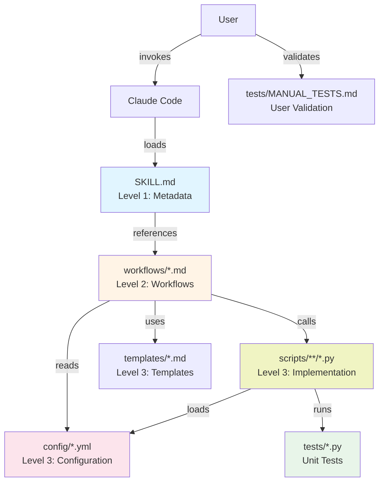
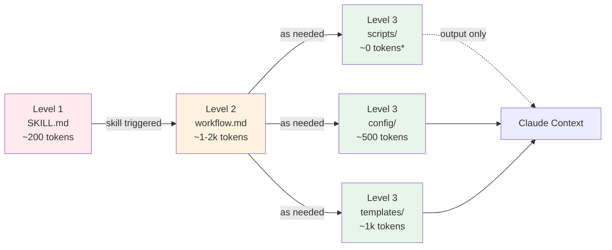
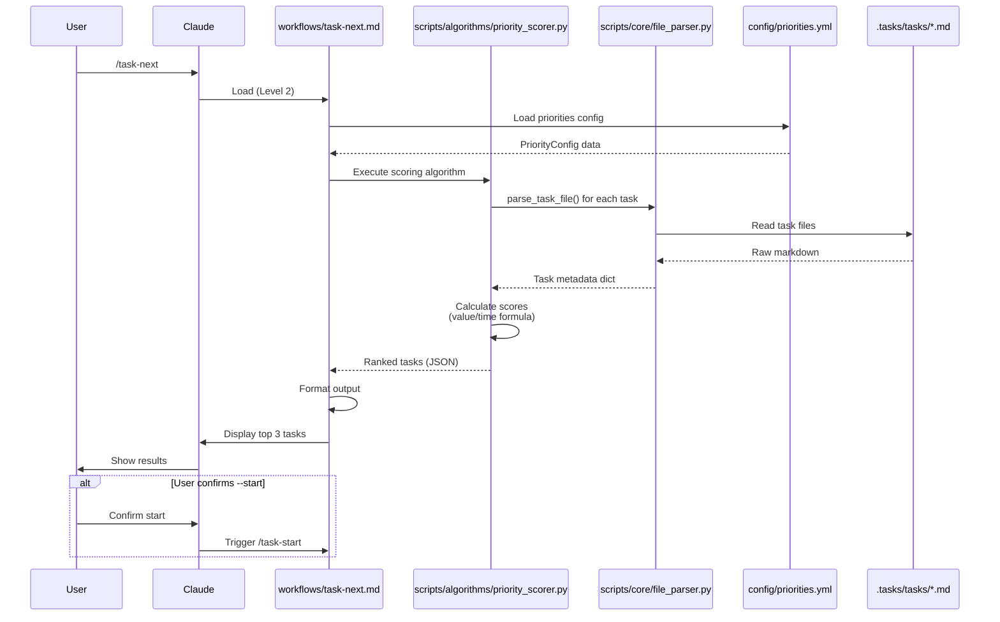
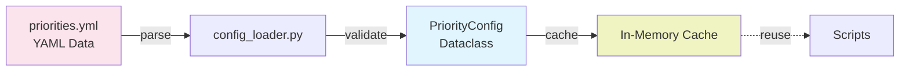

# Task Management Skill - Architecture Design

**Version:** 2.0.0
**Date:** 2025-11-16
**Status:** Session 1 - Foundation
**Task:** INF-004

---

## Table of Contents

1. [Executive Summary](#executive-summary)
2. [Architecture Overview](#architecture-overview)
3. [Progressive Disclosure (3 Levels)](#progressive-disclosure-3-levels)
4. [Directory Structure](#directory-structure)
5. [Task-Next Flow (Proof of Concept)](#task-next-flow-proof-of-concept)
6. [Reusable Patterns](#reusable-patterns)
7. [Technical Decisions](#technical-decisions)
8. [Migration Strategy](#migration-strategy)

---

## Executive Summary

This document describes the architecture for migrating the task management system from slash commands (`.claude/commands/`) to a unified Skill (`.claude/skills/task-management/`).

**Key Objectives:**

- **Optimize context**: Progressive disclosure loads only needed files
- **Improve maintainability**: Separate workflow (markdown) from logic (Python)
- **Enable testing**: Unit tests for algorithms, manual tests for workflows
- **Centralize configuration**: YAML data validated by Python dataclasses

**Session 1 Scope:**

- Establish architecture foundation
- Migrate `/task-next` as proof of concept
- Validate approach before full migration

---

## Architecture Overview



**Architecture Principles:**

1. **Separation of Concerns**: Workflow ≠ Logic ≠ Data
2. **Progressive Loading**: Only load what's needed
3. **Testability**: All logic is testable
4. **Configuration over Code**: Change behavior without touching Python

---

## Progressive Disclosure (3 Levels)

Claude Code's skill system uses progressive disclosure to minimize context usage:



**\*Note:** Scripts execute and return only **output**, not code. This is the key optimization.

### Level 1: Metadata (`SKILL.md`)

```yaml
---
name: task-management
description: Système de gestion de tâches avec workflows Git, analyse comparative, et priorisation intelligente
version: 2.0.0
---

# Task Management Skill

[Brief overview with links to workflows/]
```

- **Always loaded** by Claude Code (~100-200 tokens)
- Contains metadata for skill discovery
- Links to Level 2 workflows

### Level 2: Workflows (`workflows/*.md`)

- **Loaded when command triggered** (~1-2k tokens each)
- Markdown files with user-facing instructions
- Call Python scripts as needed
- Handle user interaction (questionnaires, confirmations)
- Examples: `task-next.md`, `task-create.md`, etc.

### Level 3: Implementation (`scripts/`, `config/`, `templates/`)

- **Loaded on-demand** or **executed without loading code**
- Python scripts: executed, only **output** loaded (~0 tokens for code)
- Config YAML: loaded when needed (~500 tokens)
- Templates: loaded when needed (~1k tokens)

**Example flow for `/task-next`:**

```mermaid
User: /task-next
→ Load SKILL.md (200 tokens)
→ Load workflows/task-next.md (800 tokens)
→ Execute scripts/algorithms/priority_scorer.py (0 tokens, output: 200 tokens)
→ Load config/priorities.yml (300 tokens)

Total: ~1500 tokens vs 3000+ tokens for old slash command
```

---

## Directory Structure

```text
.claude/skills/task-management/
├── SKILL.md                              # Entry point (Level 1)
├── skill-architecture-design.md          # This document
├── README.md                             # User documentation
│
├── config/                               # Configuration (Level 3)
│   ├── priorities.yml                   # Priority definitions
│   ├── trigrammes.yml                   # Trigramme categories
│   └── paths.yml                        # File paths
│
├── workflows/                            # Workflows (Level 2)
│   ├── task-next.md                     # [Session 1] Next task suggestion
│   ├── task-create.md                   # [Session 2] Create task
│   ├── task-from-idea.md                # [Session 2] From idea
│   ├── task-start.md                    # [Session 2] Start task
│   ├── task-complete.md                 # [Session 2] Complete task
│   ├── task-validate.md                 # [Session 2] System validation
│   ├── task-archive.md                  # [Session 3] Archive task
│   ├── task-from-analysis.md            # [Session 3] From analysis
│   └── analyze-source.md                # [Session 3] Source extraction
│
├── scripts/                              # Python implementation (Level 3)
│   ├── __init__.py
│   │
│   ├── core/                            # Core utilities
│   │   ├── __init__.py
│   │   ├── config_loader.py            # [Session 1] Load & validate YAML → dataclasses
│   │   ├── file_parser.py              # [Session 1] Parse markdown task files
│   │   ├── id_generator.py             # [Session 2] Generate unique IDs
│   │   ├── dashboard_updater.py        # [Session 2] Update TASKS.md
│   │   ├── stats_calculator.py         # [Session 2] Calculate statistics
│   │   └── git_operations.py           # [Session 2] Git helpers
│   │
│   ├── validators/                      # Validation logic
│   │   ├── __init__.py
│   │   ├── dor_validator.py            # [Session 2] Definition of Ready
│   │   ├── dod_validator.py            # [Session 2] Definition of Done
│   │   └── system_validator.py         # [Session 2] Full system validation
│   │
│   ├── algorithms/                      # Algorithmic logic
│   │   ├── __init__.py
│   │   ├── priority_scorer.py          # [Session 1] WSJF scoring
│   │   ├── branch_decider.py           # [Session 2] Branch creation logic
│   │   └── commit_generator.py         # [Session 2] Smart commit messages
│   │
│   ├── analysis/                        # Analysis-specific logic
│   │   ├── __init__.py
│   │   ├── recommendation_parser.py    # [Session 3] Parse recommendations
│   │   ├── selection_parser.py         # [Session 3] Parse '1,5,6', 'all', etc.
│   │   ├── batch_creator.py            # [Session 3] Batch task creation
│   │   └── analytics_updater.py        # [Session 3] Update ANALYSES.md
│   │
│   └── utils/                           # Shared utilities
│       ├── __init__.py
│       ├── markdown_utils.py           # Markdown formatting helpers
│       └── date_utils.py               # Date parsing & calculations
│
├── templates/                            # Templates (Level 3)
│   ├── task.md                          # Task file template
│   ├── commit-messages.md               # Commit templates
│   └── questionnaires/
│       ├── task-create.md
│       ├── task-from-idea.md
│       └── task-from-analysis.md
│
└── tests/                                # Tests
    ├── __init__.py
    ├── MANUAL_TESTS.md                  # User validation scenarios
    │
    ├── test_config_loader.py            # [Session 1]
    ├── test_file_parser.py              # [Session 1]
    ├── test_priority_scorer.py          # [Session 1]
    │
    ├── test_id_generator.py             # [Session 2]
    ├── test_dashboard_updater.py        # [Session 2]
    ├── test_validators.py               # [Session 2]
    │
    ├── test_recommendation_parser.py    # [Session 3]
    │
    └── fixtures/                        # Test data
        ├── sample_task.md
        ├── sample_tasks_dashboard.md
        └── sample_recommendations.md
```

---

## Task-Next Flow (Proof of Concept)

This is the complete flow for `/task-next` command, demonstrating the architecture:



### Data Flow Detail

**Input:**

- All task files in `.tasks/tasks/` with status "⏳ À faire"
- Priority configuration from `config/priorities.yml`

**Processing:**

1. **Parse task files** (`file_parser.py`):

   ```python
   {
       "id": "QUA-001",
       "title": "Étapes de vérification du CV",
       "status": "⏳ À faire",
       "priority": "🟡 Moyenne",
       "created_date": "2025-10-28",
       "target_date": None,
       "estimated_hours": 1.0
   }
   ```

2. **Calculate score** (`priority_scorer.py`):

   ```python
   value = (priority_score × 10) + (urgency × 5) + (age × 1)
   score = value / estimated_hours

   # Example:
   # priority=Moyenne (5) × 10 = 50
   # urgency=None (0) × 5 = 0
   # age=19 days (1.9) × 1 = 1.9
   # value = 51.9
   # time = 1 hour
   # score = 51.9 / 1 = 51.9
   ```

3. **Rank and filter**:

   ```python
   [
       TaskScore(id="QUA-001", score=51.9, ...),
       TaskScore(id="CNT-001", score=15.8, ...),
       TaskScore(id="INF-001", score=1.25, ...)
   ]
   ```

**Output:**

```markdown
💡 Prochaine tâche suggérée: QUA-001

📋 Étapes de vérification du CV
🟡 Priorité: Moyenne
⏱️  Temps estimé: 1 heure
📅 Créée le: 2025-10-28

✨ Pourquoi cette tâche?
  - Ratio valeur/temps élevé (Score: 51.9)
  - Tâche courte (1h) et impactante

Autres tâches à considérer:
  2. CNT-001 - Audit LinkedIn (Score: 15.8, 🔴 Haute, 4h)
  3. INF-001 - Intégration MCP (Score: 1.25, 🟡 Moyenne, 4h)
```

---

## Reusable Patterns

### Pattern 1: Config Loading (YAML + Python Dataclasses)

**Workflow:**



**Implementation:**

```python
# config/priorities.yml
task_priorities:
  high:
    emoji: "🔴"
    score: 10
    default_time_hours: 8
  medium:
    emoji: "🟡"
    score: 5
    default_time_hours: 4
```

```python
# scripts/core/config_loader.py
from dataclasses import dataclass
from pathlib import Path
import yaml

@dataclass
class PriorityLevel:
    emoji: str
    score: int
    default_time_hours: float

@dataclass
class PriorityConfig:
    high: PriorityLevel
    medium: PriorityLevel
    low: PriorityLevel

_cache = {}

def load_priorities() -> PriorityConfig:
    """Load and validate priorities from YAML."""
    if 'priorities' in _cache:
        return _cache['priorities']

    path = Path(__file__).parent.parent / "config" / "priorities.yml"
    with open(path) as f:
        data = yaml.safe_load(f)

    config = PriorityConfig(
        high=PriorityLevel(**data['task_priorities']['high']),
        medium=PriorityLevel(**data['task_priorities']['medium']),
        low=PriorityLevel(**data['task_priorities']['low'])
    )

    _cache['priorities'] = config
    return config
```

**Benefits:**

- ✅ Data in YAML (easy to modify)
- ✅ Validation at load time (Python types)
- ✅ Cached (no re-parsing)
- ✅ Type-safe usage in scripts

### Pattern 2: Markdown Parsing

**Common operations:**

- Extract metadata table (`| **Key** | Value |`)
- Extract subtasks (`- [ ]` / `- [x]`)
- Extract sections (`## Header`)
- Parse frontmatter

**Centralized in `file_parser.py`:**

```python
def parse_task_file(path: Path) -> dict:
    """Parse entire task file."""
    content = path.read_text()
    return {
        'metadata': parse_metadata_table(content),
        'subtasks': extract_subtasks(content),
        'description': extract_section(content, 'Description'),
        # ...
    }

def parse_metadata_table(content: str) -> dict:
    """Extract | **Key** | Value | table."""
    # Regex to match markdown table
    # Returns dict like {'Statut': '⏳ À faire', ...}
    pass
```

**Usage across commands:**

- `/task-next`: Parse all task files for metadata
- `/task-start`: Parse for DoR validation
- `/task-complete`: Parse for DoD validation
- `/task-validate`: Parse all files for consistency

### Pattern 3: Dashboard Updates

**Common pattern:**

- Read `TASKS.md`
- Find entry by ID
- Update status/priority/date
- Recalculate statistics
- Write back atomically

**Centralized in `dashboard_updater.py`:**

```python
def update_task_status(task_id: str, new_status: str):
    """Update task status in TASKS.md."""
    # 1. Read file
    # 2. Find line with [task_id]
    # 3. Replace status emoji
    # 4. Recalculate stats
    # 5. Write atomically (temp file → rename)
    pass

def recalculate_stats(content: str) -> dict:
    """Count tasks by status."""
    pass
```

### Pattern 4: Unit Testing

**Test structure:**

```python
# tests/test_priority_scorer.py
import pytest
from scripts.algorithms.priority_scorer import calculate_score, rank_tasks
from scripts.core.config_loader import load_priorities

def test_score_calculation_basic():
    """Test basic score calculation."""
    task = {
        'priority': 'medium',
        'estimated_hours': 2.0,
        'created_date': '2025-11-01',
        'target_date': None
    }
    config = load_priorities()

    score = calculate_score(task, config, today='2025-11-16')

    # priority=medium (5) × 10 = 50
    # urgency=none (0) × 5 = 0
    # age=15 days (1.5) × 1 = 1.5
    # value = 51.5
    # score = 51.5 / 2.0 = 25.75
    assert score.score == 25.75

def test_rank_tasks_empty_list():
    """Test ranking with no tasks."""
    assert rank_tasks([], load_priorities()) == []

def test_rank_tasks_equal_scores():
    """Test stable sorting when scores are equal."""
    # ... test tie-breaking logic
```

**Test fixtures:**

```text
tests/fixtures/
├── sample_task.md          # Minimal valid task
├── sample_tasks_dashboard.md  # TASKS.md sample
└── sample_recommendations.md  # Analysis recommendations
```

---

## Technical Decisions

### Decision 1: YAML + Python Dataclasses for Config

**Options considered:**

1. Pure YAML (data only, no validation)
2. Pure Python (dataclasses, no external data)
3. **YAML + Python validation** ✅ **SELECTED**

**Rationale:**

- YAML: Easy to edit, no code changes needed
- Python dataclasses: Type safety, validation, IDE autocomplete
- Cache: Load once, reuse across commands

**Trade-offs:**

- ❌ Slightly more complex than pure Python
- ✅ Much more flexible than hardcoded values
- ✅ Best of both worlds

### Decision 2: Python for Algorithms, Markdown for Workflows

**Options considered:**

1. All Python (CLI-style)
2. All Markdown (instructions only)
3. **Python logic + Markdown workflows** ✅ **SELECTED**

**Rationale:**

- Complex algorithms (WSJF, parsing) = Python (testable, fast)
- User interaction (questionnaires) = Markdown (Claude handles naturally)
- Clear separation of concerns

**Trade-offs:**

- ❌ Two languages to maintain
- ✅ Each language used for its strength
- ✅ Testable logic, readable workflows

### Decision 3: No Backup of Slash Commands

**Options considered:**

1. Auto-backup to `.claude/commands/.backup/`
2. Rename with `.legacy` suffix
3. **Git-only rollback** ✅ **SELECTED**

**Rationale:**

- Git already provides full history
- No need for extra complexity
- Clean migration (delete old, add new)

**Trade-offs:**

- ❌ No "one-click" rollback
- ✅ Simpler codebase
- ✅ Git is single source of truth

### Decision 4: Simple Manual Tests (Not Detailed)

**Options considered:**

1. Detailed step-by-step procedures
2. **Simple command + expected result** ✅ **SELECTED**
3. Interactive checklist with Claude

**Rationale:**

- Session 1 is proof of concept
- Simple tests faster to write and execute
- Can elaborate later if needed

**Trade-offs:**

- ❌ Less exhaustive coverage
- ✅ Faster iteration
- ✅ Good enough for validation

### Decision 5: Start with Design Doc (This Document)

**Options considered:**

1. **Design doc with Mermaid diagrams** ✅ **SELECTED**
2. Direct implementation (code first)
3. Minimal prototype, then design

**Rationale:**

- Complex architecture needs planning
- Mermaid diagrams clarify flows
- User validation before coding
- Reference document for future sessions

**Trade-offs:**

- ❌ Time upfront (~15 min)
- ✅ Shared understanding
- ✅ Avoid rework
- ✅ Living documentation

---

## Migration Strategy

### Session 1: Foundation (This Session)

**Goal:** Prove the architecture works

**Scope:**

- ✅ Create skill structure
- ✅ Establish config pattern (YAML + Python)
- ✅ Migrate `/task-next` (simplest algorithmic command)
- ✅ Create test patterns (unit + manual)

**Success Criteria:**

- `/task-next` via skill produces identical output to old command
- Unit tests pass
- Manual tests validated by user
- Architecture validated for Session 2

### Session 2: Core Infrastructure

**Goal:** Build reusable components

**Scope:**

- `scripts/core/` module (file_parser, id_generator, dashboard_updater, git_operations)
- `scripts/validators/` module (dor, dod, system)
- Migrate `/task-validate` (reuses validators)
- Expand test coverage

**Success Criteria:**

- Core utilities tested and reusable
- `/task-validate` functional
- Foundation for all other commands

### Session 3: Complex Commands

**Goal:** Migrate high-value commands

**Scope:**

- `/task-create`, `/task-from-idea` (interactive questionnaires)
- `/task-start`, `/task-complete` (lifecycle)
- `/task-from-analysis` (most complex, batch operations)
- Full test coverage

**Success Criteria:**

- All core commands migrated
- System fully functional
- Parallel operation with old commands validated

### Session 4: Cleanup & Documentation

**Goal:** Finalize migration

**Scope:**

- Remaining commands (`/analyze-source`, `/task-archive`)
- Update `CLAUDE.md` documentation
- Remove old slash commands
- End-to-end validation

**Success Criteria:**

- Old commands deleted
- Documentation complete
- User training complete
- System production-ready

---

## Next Steps (Session 1 Execution)

1. ✅ **Review this design doc** (validate architecture)
2. ⏭️ Create skill structure (directories, `__init__.py`)
3. ⏭️ Implement config system (YAML + Python)
4. ⏭️ Implement `file_parser.py` with tests
5. ⏭️ Migrate WSJF algorithm to `priority_scorer.py` with tests
6. ⏭️ Create `workflows/task-next.md`
7. ⏭️ Create `SKILL.md` entry point
8. ⏭️ Create `MANUAL_TESTS.md`
9. ⏭️ Run all tests, validate with user
10. ⏭️ Commit Session 1

**Estimated time:** ~2-2.5 hours

---

## Appendix: Reference Links

- [Agent Skills Documentation](https://docs.claude.com/en/docs/agents-and-tools/agent-skills/overview)
- [Progressive Disclosure](https://www.anthropic.com/engineering/equipping-agents-for-the-real-world-with-agent-skills)
- [Existing Priority Script](../../../scripts/priority_weight.py)
- [Task Rules (DoR/DoD)](../../.tasks/TASK_RULES.md)

---

**End of Design Document**
