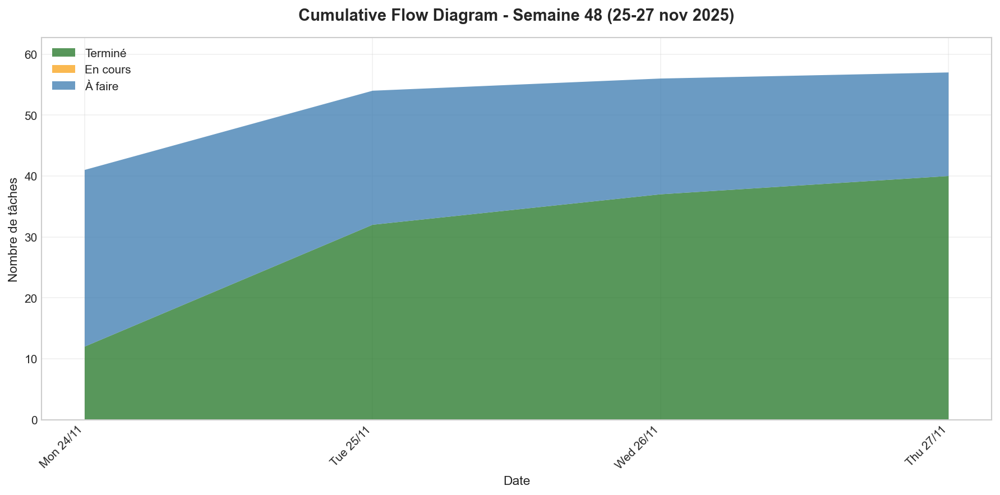
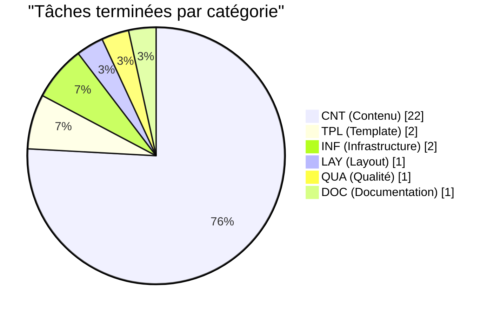
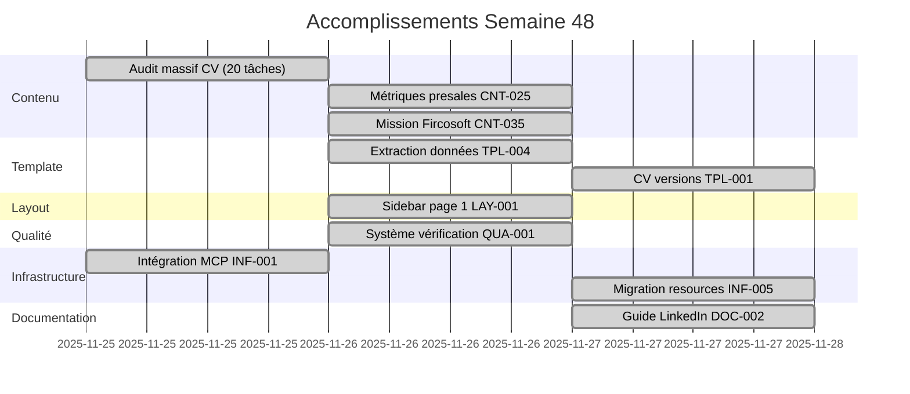
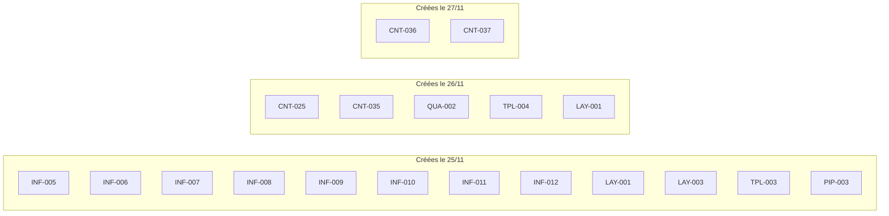
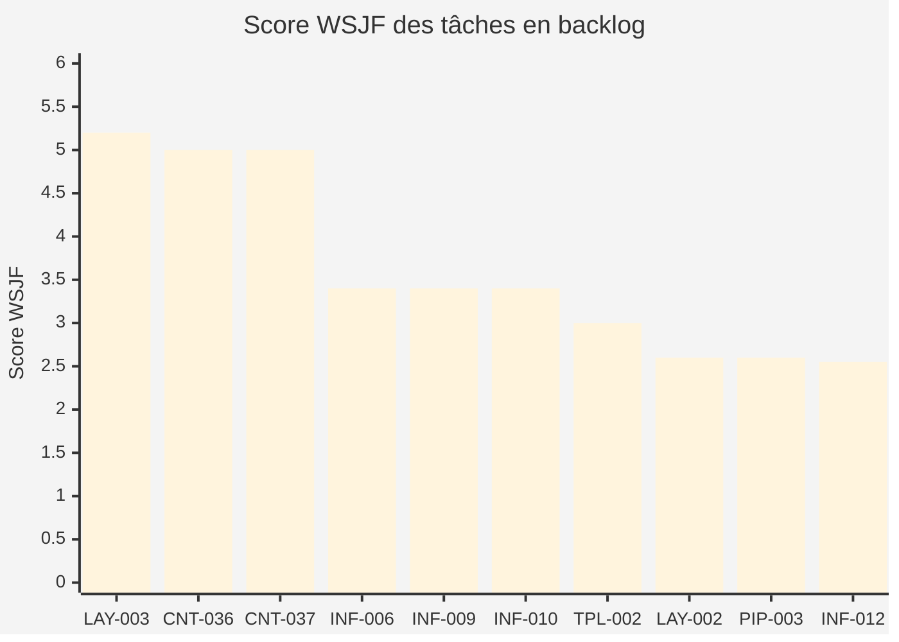
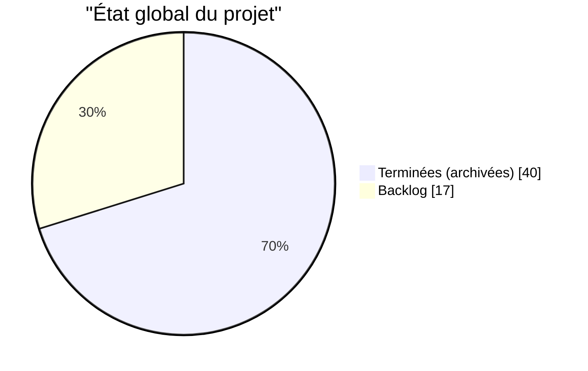

# Récapitulatif Hebdomadaire - Semaine 48 (25-27 novembre 2025)

## Vue d'ensemble

| Métrique | Valeur |
|----------|--------|
| **Période** | 25-27 novembre 2025 |
| **Tâches terminées** | 28 |
| **Tâches créées** | 19 |
| **Tâches en cours** | 0 |
| **Backlog actuel** | 17 |

---

## Flux cumulatif (Cumulative Flow Diagram)

**Lecture du CFD :**

- **Vert (Terminé)** : Croissance régulière, 28 tâches terminées cette semaine
- **Orange (En cours)** : WIP très faible (~0.5) = travail séquentiel tâche par tâche
- **Bleu (À faire)** : Backlog réduit malgré l'ajout de 19 nouvelles tâches
- **Lead Time** : ~0.5 jour (distance horizontale entre courbes)

> Régénérer avec : `uv run --with matplotlib --with numpy scripts/reports/generate_cfd.py --week 2025-W48 --output .tasks/reports/`

### Détail par jour

| Jour | Terminées | Créées | Cumul terminé |
|------|-----------|--------|---------------|
| Lundi 25 | 20 | 12 | 20 |
| Mardi 26 | 5 | 5 | 25 |
| Mercredi 27 | 3 | 2 | 28 |

---

## Répartition par catégorie

### Détail des catégories

| Trigramme | Terminées | Créées | En backlog |
|-----------|-----------|--------|------------|
| CNT | 22 | 2 | 2 |
| INF | 2 | 7 | 7 |
| TPL | 2 | 1 | 2 |
| LAY | 1 | 2 | 2 |
| QUA | 1 | 1 | 1 |
| DOC | 1 | 0 | 0 |
| PIP | 0 | 1 | 2 |

---

## Timeline des accomplissements

---

## Tâches terminées

### Lundi 25 novembre (20 tâches)

#### Contenu - Audit et corrections

| ID | Titre | Priorité |
|----|-------|----------|
| CNT-005 | Corriger dates début freelance | 🔴 Haute |
| CNT-006 | Ajouter certifications manquantes | 🔴 Haute |
| CNT-008 | Ajouter expérience IBP | 🟡 Moyenne |
| CNT-009 | Ajouter expérience DEKRA | 🟡 Moyenne |
| CNT-010 | Ajouter section bénévolat | 🟡 Moyenne |
| CNT-014 | Analyse expérience PALO IT | 🔴 Haute |
| CNT-015 | Analyse CV Flash | 🟡 Moyenne |
| CNT-016 | Enrichir section expérience détaillée | 🔴 Haute |
| CNT-017 | Corriger données critiques PALO IT CTO | 🔴 Haute |
| CNT-023 | Mettre à jour photo profil | 🟡 Moyenne |
| CNT-024 | Analyse CV Flash 2025 | 🟡 Moyenne |
| CNT-027 | Ajouter missions clients Upwiser | 🔴 Haute |
| CNT-028 | Ajouter activités communautaires | 🟡 Moyenne |
| CNT-029 | Améliorations CV Flash priorité moyenne | 🟡 Moyenne |
| CNT-030 | Ajouter expériences récentes (Beta.gouv, Nalo) | 🔴 Haute |
| CNT-031 | Enrichir expérience PALO IT CTO complète | 🔴 Haute |
| CNT-032 | Moderniser en-tête CV | 🔴 Haute |
| CNT-033 | Améliorer section "À propos" | 🔴 Haute |
| CNT-034 | Restructurer expérience PALO IT | 🔴 Haute |

#### Infrastructure

| ID | Titre | Priorité |
|----|-------|----------|
| INF-001 | Intégration MCP | 🟡 Moyenne |

### Mardi 26 novembre (5 tâches)

| ID | Titre | Catégorie | Priorité |
|----|-------|-----------|----------|
| CNT-025 | Remplacer 15% CA par chiffres presales | CNT | 🔴 Haute |
| CNT-035 | Ajouter mission Fircosoft | CNT | 🟡 Moyenne |
| TPL-004 | Extraction données structurées | TPL | 🟡 Moyenne |
| LAY-001 | Sidebar première page uniquement | LAY | 🟡 Moyenne |
| QUA-001 | Système de vérification CV | QUA | 🟡 Moyenne |

### Mercredi 27 novembre (3 tâches)

| ID | Titre | Catégorie | Priorité |
|----|-------|-----------|----------|
| TPL-001 | Créer versions courte/longue CV | TPL | 🟡 Moyenne |
| DOC-002 | Guide optimisation LinkedIn | DOC | 🔴 Haute |
| INF-005 | Répertoire ressources dédié | INF | 🟡 Moyenne |

---

## Tâches créées cette semaine

### Nouvelles tâches en backlog

| ID | Titre | Priorité | Score WSJF |
|----|-------|----------|------------|
| CNT-036 | Condensation et impact business (version longue) | 🔴 Haute | 5.00 |
| CNT-037 | Optimisation version courte (1 page) | 🟡 Moyenne | 5.00 |
| LAY-003 | Réorganiser compétences en 3 pôles | 🟡 Moyenne | 5.20 |
| INF-006 | Extraire scripts et tests hors `.claude/` | 🔴 Haute | 3.40 |
| INF-008 | Architecture système skills candidature | 🔴 Haute | 2.55 |
| INF-009 | Skill analyse d'offre d'emploi | 🔴 Haute | 3.40 |
| INF-010 | Skill analyse adéquation profil-poste | 🔴 Haute | 3.40 |
| INF-011 | Skill assistant lettre de motivation | 🟡 Moyenne | 1.73 |
| INF-012 | Skill CV adapté à l'offre | 🔴 Haute | 2.55 |
| QUA-002 | Vérification orthographique et grammaticale | 🟡 Moyenne | 1.70 |

---

## Priorités par score WSJF

---

## Livrables de la semaine

### CV

- **cv.pdf** : Version exhaustive (5 pages) - base de données de contenu
- **cv-short.pdf** : Version courte (1 page) - candidatures rapides

### Infrastructure

- **neat-cv-local.typ** : Fork du template avec sidebar page 1 uniquement
- **cv-data.typ** : Données structurées extraites
- **resources/** : Nouveau répertoire dédié aux ressources d'analyse

### Documentation

- **linkedin-optimization-guide.md** : Guide complet d'optimisation LinkedIn

### Qualité

- **scripts/verification/** : Module Python de vérification CV (53 tests)

---

## Points forts de la semaine

1. **Audit massif du contenu** : 22 tâches CNT terminées, CV enrichi avec métriques d'impact
2. **Architecture template** : Fork de neat-cv pour layout optimisé (sidebar page 1)
3. **Versions multiples** : CV court (1 page) + exhaustif (5 pages) + build automatisé
4. **Système skills candidature** : Architecture définie pour 5 skills interconnectés

---

## Prochaines priorités

| Rang | ID | Titre | Score |
|------|-------|-------|-------|
| 1 | LAY-003 | Réorganiser compétences en 3 pôles | 5.20 |
| 2 | CNT-036 | Condensation et impact business | 5.00 |
| 3 | CNT-037 | Optimisation version courte | 5.00 |
| 4 | INF-009 | Skill analyse d'offre d'emploi | 3.40 |
| 5 | INF-010 | Skill analyse adéquation | 3.40 |

---

## Notes et observations

- [ ] À compléter avec observations personnelles
- [ ] Retours utilisateur à intégrer
- [ ] Blocages rencontrés
- [ ] Améliorations process suggérées

---

## Statistiques globales du projet

| Métrique | Valeur |
|----------|--------|
| **Total tâches créées** | 57 |
| **Total terminées** | 40 |
| **Taux de complétion** | 70% |
| **Backlog actif** | 17 |
| **Vélocité semaine** | 28 tâches |

---

*Généré le 2025-11-27*
